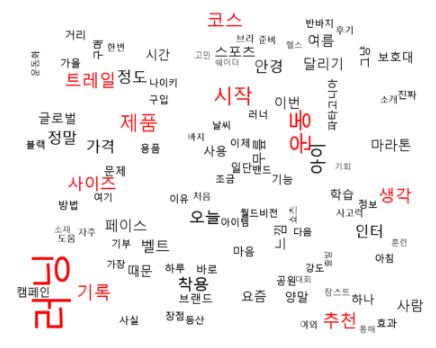
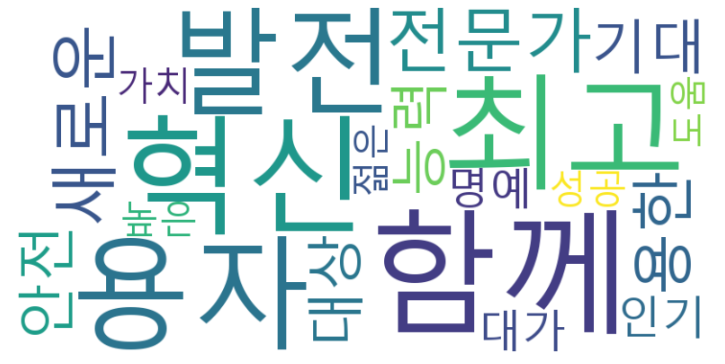

### 📌 웹 스크래핑 모듈 | [ann.py](ann.py) 
- 한국일보, 동아일보, 중앙일보, 한겨레, 국민일보, 조선일보 
- 네이버 블로그, 네이버 쇼핑, 쿠팡
- 구글, 네이버, 빙 이미지 수집
- 유튜브 댓글 수집

&nbsp;

### 📌 시각화 모듈 | [graph.py](graph.py)  
- plotly, matplotlib, konlpy, wordcloud 
<table style="width: 100%; text-align: center; border-collapse: collapse;">
  <tr>
    <td style="padding: 10px;">
       
      
Pie Chart 1

    </td>
    <td style="padding: 10px;">
       
      
Pie Chart 2

    </td>
  </tr>
  <tr>
    <td style="padding: 10px;">
       
      
Line Chart

    </td>
    <td style="padding: 10px;">
       
      
Bar Chart 1

    </td>
  </tr>
  <tr>
    <td style="padding: 10px;">
       
      
Bar Chart 2

    </td>
    <td style="padding: 10px;">
       
      
Amount Word Cloud

    </td>
  </tr>
  <tr>
    <td style="padding: 10px;">
       
      
Related Words Word Cloud

    </td>
    <td style="padding: 10px;">
       
      
Pos/Neg Word Cloud

    </td>
  </tr>
</table>

&nbsp;

### 📌 python base | [base.py](base.py)  
- 파이썬 기초 문법 및 함수 
- 교재: Do it! 점프 투 파이썬 

&nbsp;

