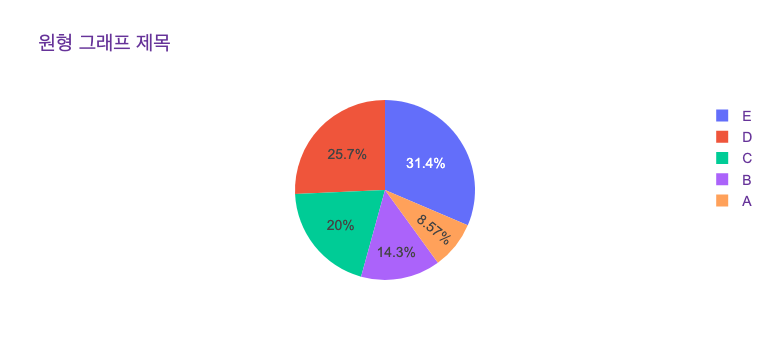
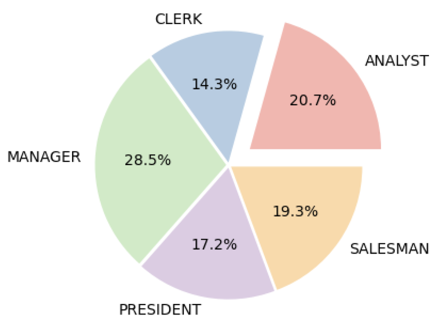
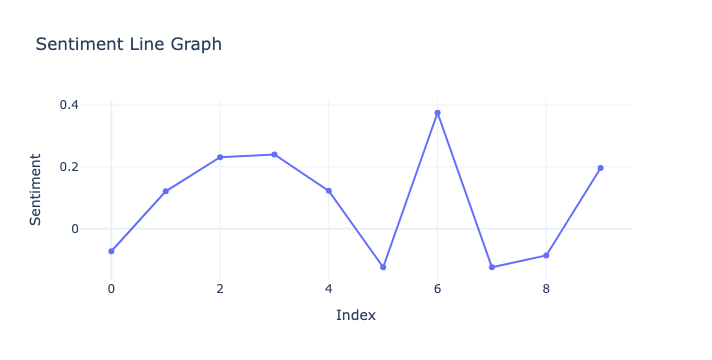
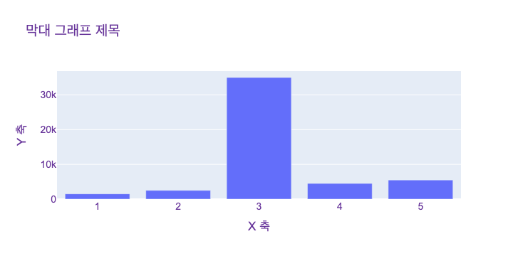
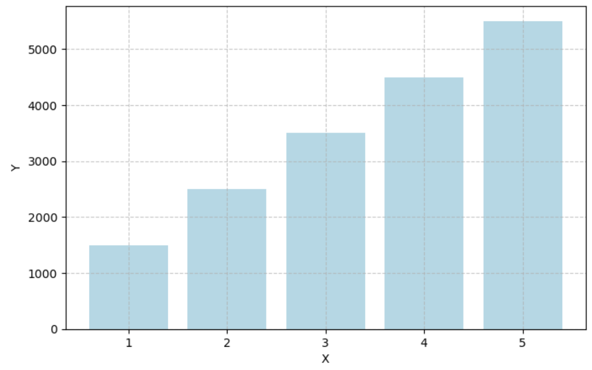
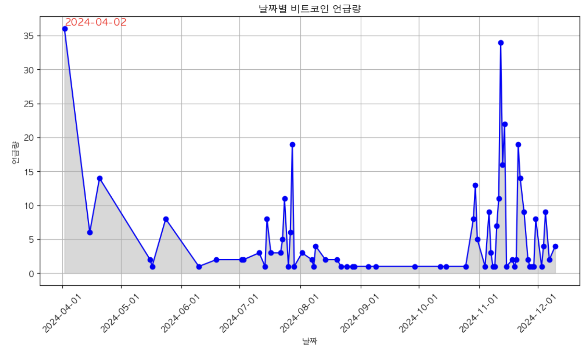

### 📌 웹 스크래핑 모듈 | [ann.py](ann.py) 
- 한국일보, 동아일보, 중앙일보, 한겨레, 국민일보, 조선일보 
- 네이버 블로그, 네이버 쇼핑, 쿠팡
- 구글, 네이버, 빙 이미지 수집
- 유튜브 댓글 수집
- 연관어 분석 시각화

&nbsp;

### 📌 시각화 모듈 | [graph.py](graph/graph.py)  
 
 
 
 
 
 

